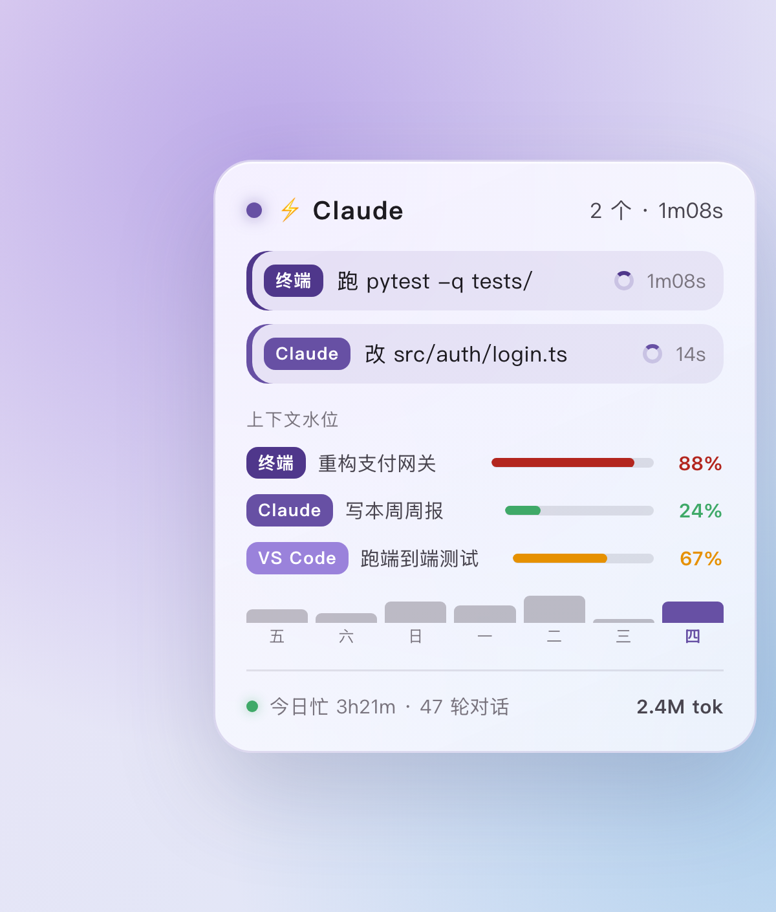

# Claude Code 控制中心 · Claude Code Control Center

**Mission control for every Claude Code you've got running.** One macOS desktop widget (via [Übersicht](http://tracesof.net/uebersicht/)) that watches Claude Code across **Terminal**, the **Claude desktop app**, and **VS Code** — all at once, in a single glance: live task rows, each session's context-window fill level (color-warned as it fills, auto-removed when the session ends), and a 7-day activity trend. 100% local, no API key, nothing ever leaves your machine.

> **一块桌面「控制中心」，一眼掌管所有正在跑的 Claude Code。** 无论它跑在 **Terminal**、**Claude 桌面 App** 还是 **VS Code**——三处并发的长任务同屏直击，每个会话的上下文水位实时预警（快满变橙/红、会话结束自动撤下），近 7 天活跃尽收眼底。纯本机运行，零 API key，数据不出你的电脑。

## Features

- **实时任务行** — 三个渠道并行：每行 `[来源] [在干嘛] [转圈] [用时]`，工具映射成中文动词（跑 / 读 / 写 / 改 / 搜 / 找 / 抓 / 子任务…）。没工具在跑时区分「正在思考」与「正在回复」。
- **上下文水位** — 每个活跃会话占了多少窗口。**按客户端自动识别 200K vs 1M 窗口**（某客户端历史越过 200K → 判定 1M）。<60% 绿 / 60–85% 橙 / ≥85% 红。每条带会话开场白，区分同渠道多个会话；会话结束/删除后自动撤下，会话多了卡片自动长高。
- **近 7 天趋势** — 每日对话轮数迷你柱状图，今天高亮。
- **底栏汇总** — 今日全渠道忙时长 · 对话轮数 · 新增 token（≈ 控制台用量）。

## How it works

| 文件 | 作用 |
|------|------|
| `index.jsx` | Übersicht 卡片（每秒刷新、可拖拽） |
| `cc-progress-hook.py` | Claude Code 钩子，写实时事件到 `~/.claude/cc-progress.jsonl`，长任务完成发原生通知 |
| `cc-stats.py` | 扫 `~/.claude/projects/*.jsonl` 转录算今日总量 / 每会话水位 / 7 天趋势，两级缓存 |

实时行来自 hook 写的事件日志；统计/水位/趋势来自直接读 Claude Code 自己的转录文件——**无网络、无 API key**。

## Install

Easiest: hand this repo to Claude Code and say "装这个 widget" — the `SKILL.md` walks Claude through it.

Manual:
1. Install & launch [Übersicht](http://tracesof.net/uebersicht/).
2. `cp cc-progress-hook.py cc-stats.py ~/.claude/`
3. `cp index.jsx "~/Library/Application Support/Übersicht/widgets/cc-progress.widget/index.jsx"` (replace `$HOME` inside it with your home path).
4. Merge `settings.hooks.json` into `~/.claude/settings.json` (append the 6 hooks, don't overwrite; replace `$HOME` with your home path).
5. Start a **new** Claude Code session — the hooks attach at session start.

Full steps, customization, and uninstall are in [`SKILL.md`](SKILL.md).

## Privacy

Everything is local. `cc-stats.py` only reads Claude Code's own transcripts under `~/.claude/projects` to compute totals; nothing is uploaded. Runtime data files (`cc-progress.jsonl`, `cc-stats-cache.json`, `cc-history.json`, `cc-progress-daily.json`) contain your session titles/paths and are git-ignored.

## Requirements

macOS · [Übersicht](http://tracesof.net/uebersicht/) · `python3` (system one at `/usr/bin/python3`) · Claude Code.

## License

MIT
